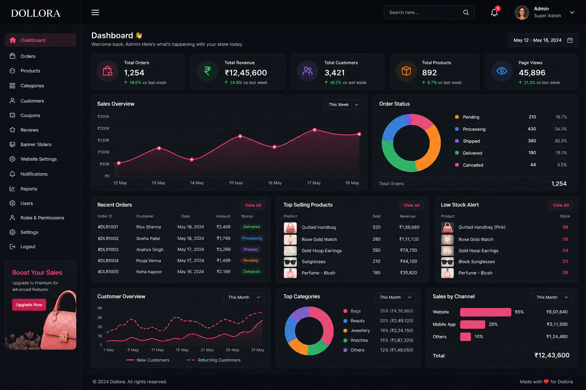

# 🛍️ Dollora - Modern E-Commerce Store

Dollora is a full-stack e-commerce web application built with Django and PostgreSQL, designed to provide a modern online shopping experience with category-based browsing, wishlist management, product comparison, and an admin-powered product management system.

---

## 🚀 Features

### Customer Features

* Browse products by category
* Search products by name
* Product detail pages
* Wishlist functionality
* Shopping cart
* Product comparison
* Multi-category product support
* Responsive Amazon/Flipkart-inspired UI
* Product discount badges
* Pagination support
* User authentication

### Admin Features

* Django Admin Dashboard
* Add/Edit/Delete Products
* Upload Product Images
* Manage Categories
* Manage Orders
* Manage Users
* Manage Product Discounts

---

## 🛠️ Tech Stack

### Backend

* Django 6
* Python 3.13
* PostgreSQL (Neon)

### Frontend

* HTML5
* CSS3
* Bootstrap 5
* JavaScript

### Deployment

* Render
* Neon PostgreSQL
* WhiteNoise
* Gunicorn

---

## 📂 Project Structure

```bash
dollora/
│
├── config/
│   ├── settings.py
│   ├── urls.py
│   └── wsgi.py
│
├── store/
│   ├── models.py
│   ├── views.py
│   ├── admin.py
│   ├── urls.py
│   └── templates/
│
├── media/
├── static/
├── requirements.txt
├── manage.py
└── .env
```

---

## ⚙️ Environment Variables

Create a `.env` file in the project root.

```env
SECRET_KEY=your_secret_key_here

DATABASE_URL=your_neon_postgresql_url

DEBUG=False

ALLOWED_HOSTS=.onrender.com

CSRF_TRUSTED_ORIGINS=https://your-app.onrender.com
```

---

## 🔧 Local Installation

### Clone Repository

```bash
git clone https://github.com/yourusername/dollora.git
cd dollora
```

### Create Virtual Environment

```bash
python -m venv .venv
```

### Activate Virtual Environment

Windows:

```bash
.venv\Scripts\activate
```

Linux/Mac:

```bash
source .venv/bin/activate
```

### Install Dependencies

```bash
pip install -r requirements.txt
```

### Run Migrations

```bash
python manage.py migrate
```

### Start Development Server

```bash
python manage.py runserver
```

Open:

```text
http://127.0.0.1:8000/
```

---

## 🗄️ Database

This project uses:

* Neon PostgreSQL
* Django ORM
* Environment-based database configuration

Connection is handled through:

```env
DATABASE_URL=
```

---

## 🚂 Render Deployment

### Build Command

```bash
pip install -r requirements.txt && python manage.py collectstatic --noinput
```

### Start Command

```bash
gunicorn config.wsgi:application
```

### Environment Variables

Add in Render:

```env
SECRET_KEY=your_secret_key

DATABASE_URL=your_neon_database_url

DEBUG=False

ALLOWED_HOSTS=.onrender.com

CSRF_TRUSTED_ORIGINS=https://your-app.onrender.com
```

---

## 📸 Screenshots

Add screenshots here after deployment:

### Home Page


### Product Page


### Admin Dashboard



---

## 🔮 Future Enhancements

* Payment Gateway Integration
* Order Tracking
* Product Reviews & Ratings
* AI Product Recommendations
* Email Notifications
* Coupon System
* Inventory Management
* Analytics Dashboard

---

## 👩‍💻 Author

Dhanyasree Gopinigari

* GitHub: https://github.com/dhanyasreegopinigari-blue
* LinkedIn: https://linkedin.com/in/dhanyasree-gopinigari-694378409

---

## 📜 License

This project is developed for educational, portfolio, and learning purposes.
