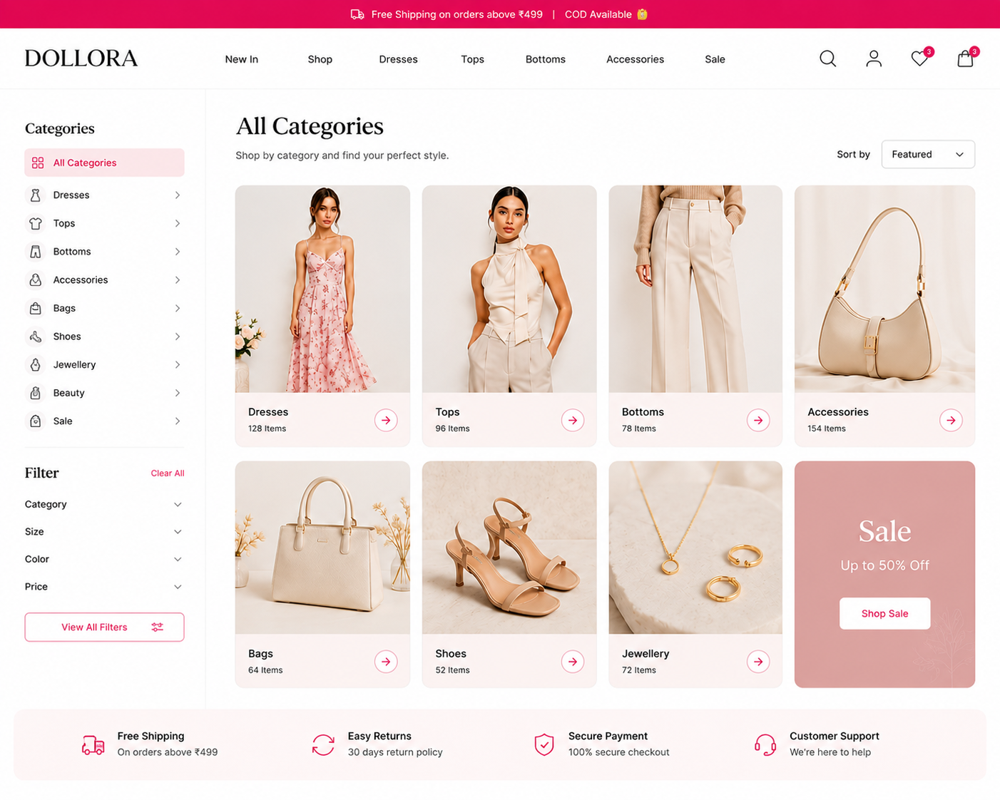
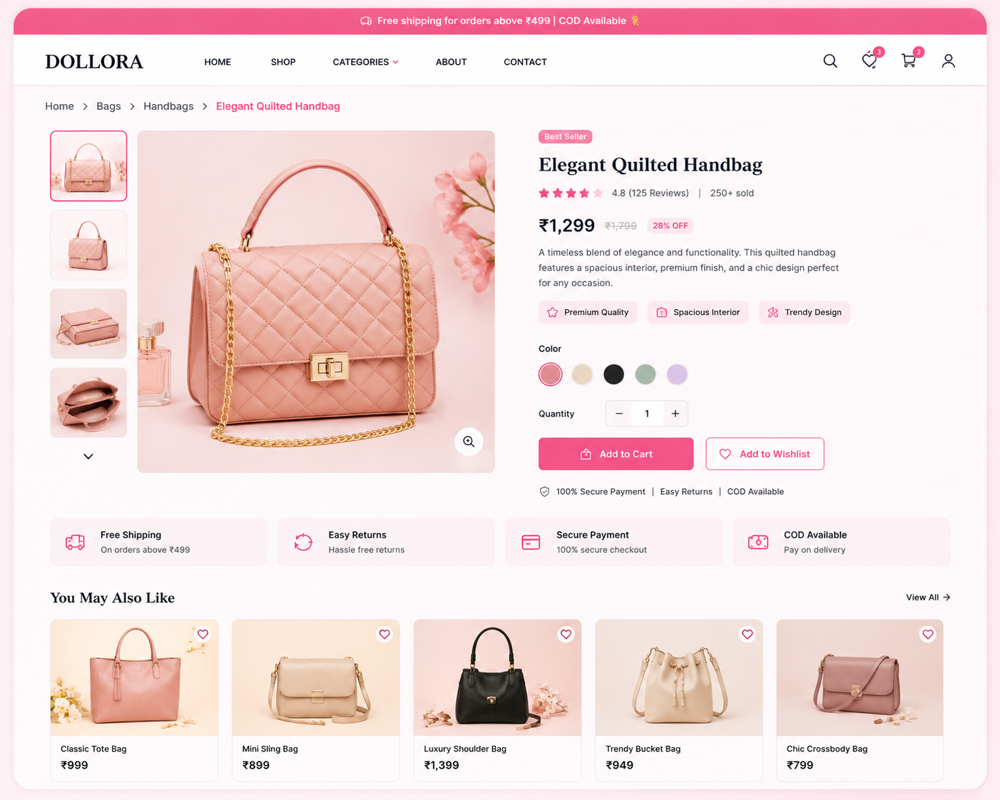
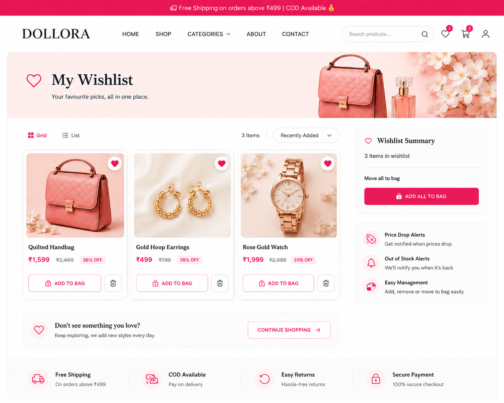

# 🛍️ Dollora - Modern E-Commerce Platform

Dollora is a full-stack e-commerce web application built with Django and PostgreSQL, designed to provide a seamless online shopping experience. The platform allows users to browse products, manage wishlists, explore categories, and place orders through an intuitive and responsive interface.

---

## 🚀 Live Demo

🌐 Website: https://dollora-1.onrender.com

🛠️ Django Admin: https://dollora-1.onrender.com/admin

---

## 📸 Screenshots

### Homepage


### Categories


### Product Details


### Wishlist


### Admin Dashboard


---

## ✨ Features

### Customer Features
- Browse products by category
- Product detail pages
- Wishlist functionality
- Search products
- Responsive design
- Product discount badges
- Product image gallery
- Pagination support
- Dynamic category filtering

### Admin Features
- Secure Django Admin Panel
- Add/Edit/Delete Products
- Manage Categories
- Upload Product Images
- Inventory Management
- Manage Orders
- Manage Users
- Product Discount Management

---

## 🛠️ Tech Stack

### Backend
- Django 6
- Python 3.13

### Database
- PostgreSQL (Neon)

### Frontend
- HTML5
- CSS3
- Bootstrap
- JavaScript

### Deployment
- Render / Railway
- Gunicorn
- WhiteNoise

### Version Control
- Git
- GitHub

---

## 📂 Project Structure

```bash
Dollora/
│
├── accounts/
├── store/
├── templates/
├── media/
├── static/
├── config/
│
├── manage.py
├── requirements.txt
├── .env.example
└── README.md
```

---

## ⚙️ Installation

### 1. Clone Repository

```bash
git clone https://github.com/your-username/Dollora.git
cd Dollora
```

### 2. Create Virtual Environment

```bash
python -m venv .venv
```

### Activate Environment

#### Windows

```bash
.venv\Scripts\activate
```

#### Linux / Mac

```bash
source .venv/bin/activate
```

### 3. Install Dependencies

```bash
pip install -r requirements.txt
```

### 4. Create Environment Variables

Create a `.env` file in the project root:

```env
SECRET_KEY=your-secret-key
DEBUG=True
DATABASE_URL=your-neon-postgresql-url
```

### 5. Apply Migrations

```bash
python manage.py migrate
```

### 6. Create Superuser

```bash
python manage.py createsuperuser
```

### 7. Run Development Server

```bash
python manage.py runserver
```

Visit:

```text
http://127.0.0.1:8000/
```

---

## 🌍 Deployment

### Build Command

```bash
pip install -r requirements.txt && python manage.py collectstatic --noinput && python manage.py migrate
```

### Start Command

```bash
gunicorn config.wsgi:application
```

### Environment Variables

```env
SECRET_KEY=your-secret-key
DATABASE_URL=your-neon-postgresql-url
DEBUG=False
ALLOWED_HOSTS=your-domain.com
CSRF_TRUSTED_ORIGINS=https://your-domain.com
```

---

## 🗄️ Database

Dollora uses:

- PostgreSQL (Neon)
- Django ORM
- Environment-based database configuration

---

## 🔐 Security Features

- Environment Variables for Secrets
- CSRF Protection
- Secure Authentication
- Protected Admin Panel
- Production Ready Configuration

---

## 📈 Future Enhancements

- Payment Gateway Integration (Razorpay / Stripe)
- Order Tracking
- User Reviews & Ratings
- Coupon System Enhancements
- Email Notifications
- AI Product Recommendations
- Multi-Vendor Support

---

## 👨‍💻 Author

**Dhanyasree Gopinigari**

GitHub:
[(Github)](https://github.com/dhanyasreegopinigari-blue)

LinkedIn:
[(Linkedin)](https://www.linkedin.com/in/dhanyasree-gopinigari/)

---

## ⭐ Support

If you found this project useful:

- Star the repository ⭐
- Fork the project 🍴
- Share feedback 🚀

---

## 📄 License

This project is licensed under the MIT License.

Copyright © 2026 Dhanyasree Gopinigari